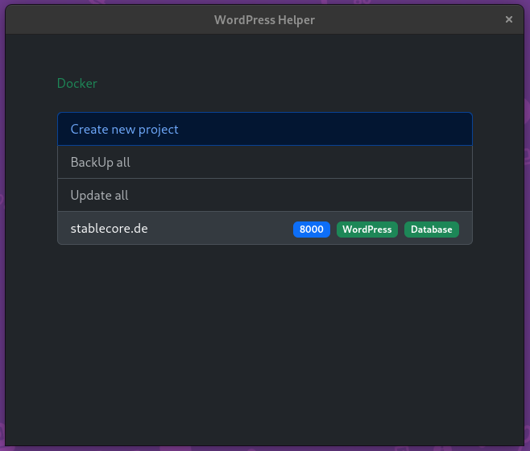
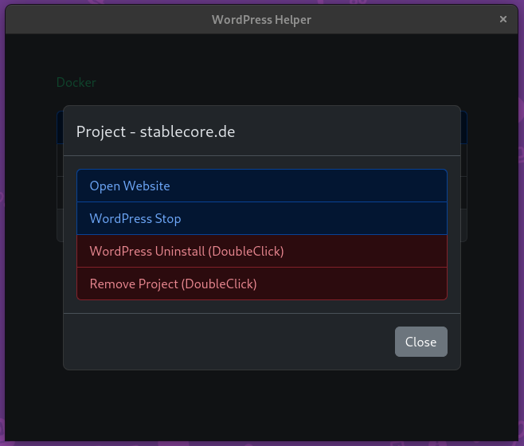

# WordPress Helper

Tool for my girlfriend and anyone who work with WordPress-sites and dont want thinks with docker.

You need to have Docker installed.





## Features now

- Create, Install, Start, Stop, Open, Uninstall and remove multible WordPress projects in client.

## Features in work

- BackUp & Restore local
- Update WP-container
- Add server and push WP-projects via SSH to them
- BackUp & Restore on server

## Install

```bash
$ npm install
```

### Build

```bash
# For windows
$ npm run build:win

# For macOS
$ npm run build:mac

# For Linux
$ npm run build:linux
```
